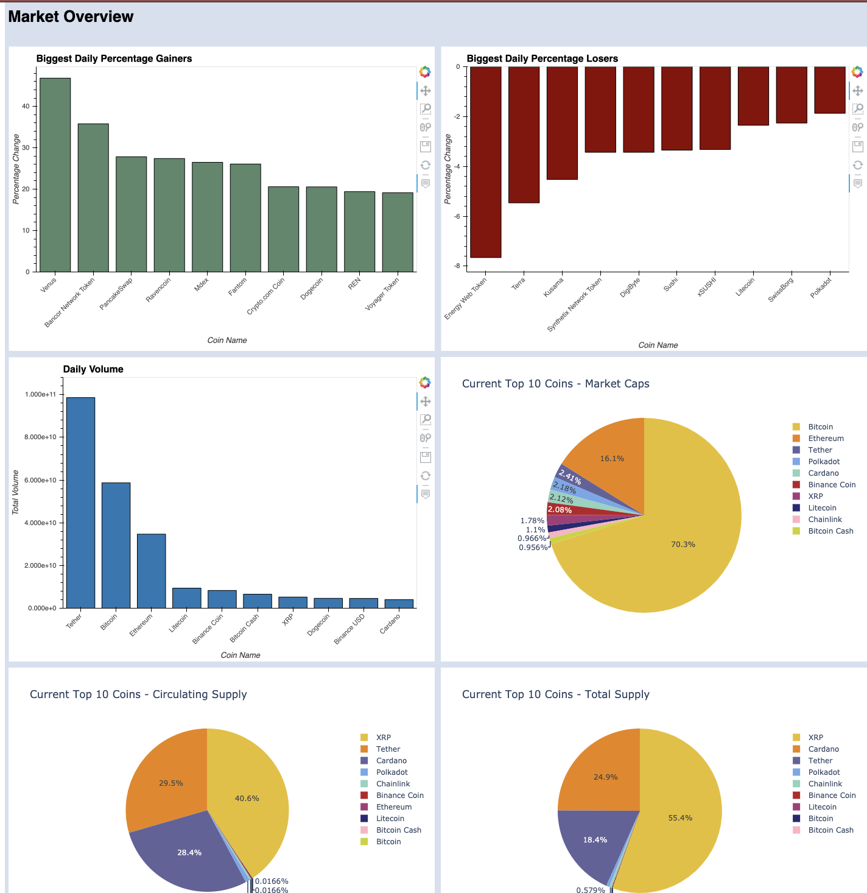
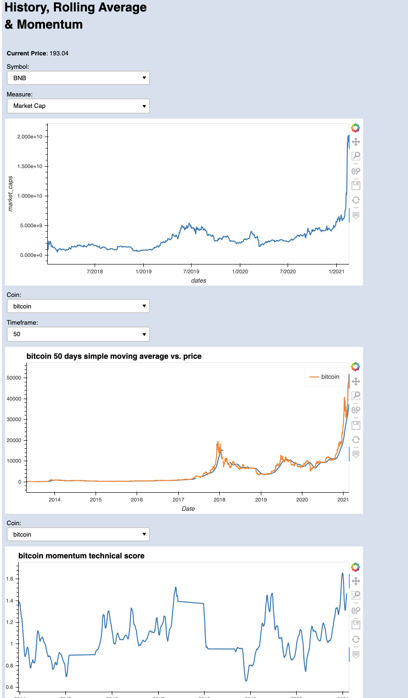
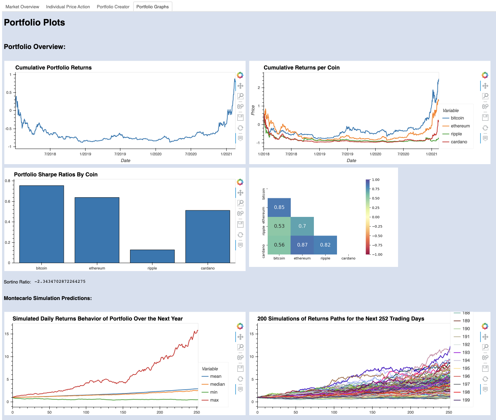
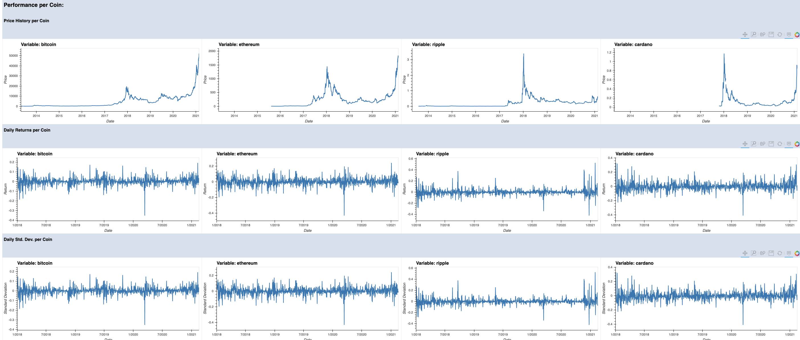

# CryptoMarket-Scout
Team Members: Santiago Pedemonte, Sean Simmons, Rawnak Mahjabib, Siegfried Vieluf,
Samuel Akinnubi

##  Project Mission:

-  CryptoMarket Scout utilizes CoinGecko's API to gather historical data on several cryptocurrencies

-  We have created interactive visualizations containing price action on various single cryptocurrency coins 

- CryptoMarket Scout provides "Market Snapshots" of the cryptocurrency market that allows the User to access several summary metrics such as daily percentage winners/losers, market cap, total volume, circulating supply, and more.

- We have created tools to allow Users to create their own custom cryptocurrency portfolio. 

- Our models help Users run Monte Carlo simulations on their custom portfolio, calculate measures such as their cumulative returns over time, and Sortino Ratio of their custom portfolio. 

- The dashboards we have built are all publicly displayed and available for use on our Web page published at:  <a href="https://rawnakmahjabib.github.io/CryptoMarket-Scout/">CryptoMarket Scout</a>

## Market Overview

- Through the tools we have built, in the first tab of our Dashboard, Users are able to gain information about which coins had the greatest percentage gains/losses over the last 24 hour period, daily volume, market cap, circulating supply & total supply. All visualizations are interactive and user-friendly. 

- The next tab of our Dashboard allows Users the ability to use a dropdown menu to select a coin of their choosing to view historical price action, rolling averages over a specified timeframe of the User's choosing, and momentum. 

- Currently, Users are able to view various summary metrics of a pre-selected portfolio that is equally weighted. These metrics provide insight to how the portfolio performed as a whole in addition to its individual components. 

# CryptoMarket Drivers 

What drives cryptocurrency prices? Some hypothesize it is market sentiment, economic metrics, and possible celebrity endorsements. We chose to investigate by utilizing machine learning techniques to identify what the drivers behind the price of Bitcoin are. 

## Glossary of features we analyzed: 

- Central Bank Balance Sheet: summarizes its financial position, and is made up of assets, liabilities and equity. 
US Budget Balance
- US Consumer Price Index (CPI): a measure of the average change over time in the prices paid by urban consumers for a market basket of consumer goods and services. 
- Conference Board Inflation Expectations: contains consumer expectations for inflation, stock prices, and interest rates. 
Global Risk Demand Index: gauges the change in risk demand from the price performance of risky assets relative to safe ones.
- Dollar Index: a measure of the value of the U.S. dollar relative to a basket of foreign currencies, often referred to as a basket of U.S. trade partner’s currencies. The index goes up when the  US dollar gains strength (value) compared to other currencies. 
- CITI Dollar Positioning: this is a measure of dollar positioning, the thinking being as people get more short USD - they buy more Bitcoin.
- Volatility Index (VIX): looks at expectations of future volatility, also known as implied volatility. 
- Currency Volatility Index (CVIX): created by computing a decentralized volatility  index from cryptocurrency option prices.
- Merrill Lynch Option Volatility Estimate (MOVE): indicator of U.S. interest rate volatility. It measures the implied yield volatility of a basket of one-month over-the-counter options on 2-year, 5-year, 10-year, and 30-year Treasuries.  
- Sector Rotation Index: designed to rotate sector allocations based on favorable characteristics regardless of the economic environments. 
- Bloomberg Commodity Index (BCOM): is calculated on an excess return basis and reflects commodity futures price movements. 
- Bitcoin Story Count: global search volume for Bitcoin 

